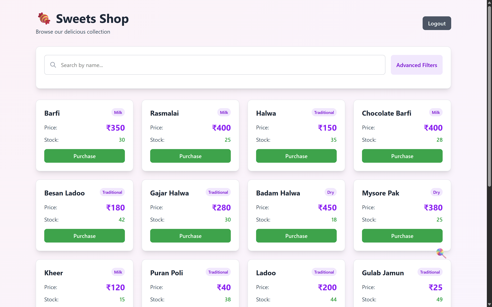
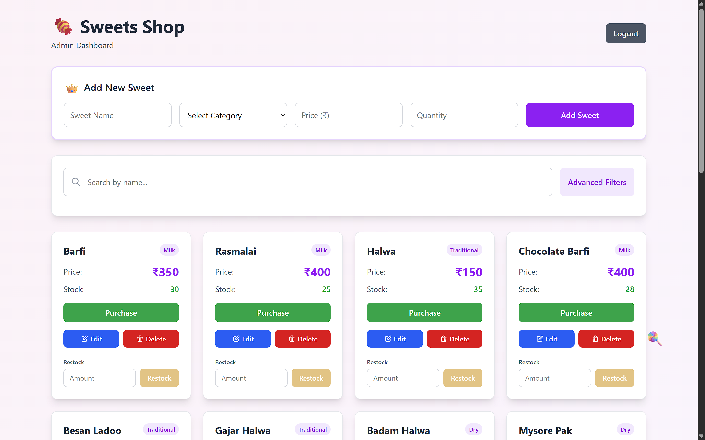

🍬 Sweet Shop Management System

A full-stack Sweet Shop Management System built using Test-Driven Development (TDD).
The application allows authenticated users to browse and purchase sweets, while admin users can manage inventory and sweets catalog.

🚀 Features

🔐 Authentication

- User registration & login
- JWT-based authentication
- Role-based access control (USER / ADMIN)

🍭 Sweets Management

- List all available sweets (protected)
- Search sweets by:
  - Name
  - Category
  - Price range
- Create, update, and delete sweets (Admin only)

📦 Inventory Management

- Purchase a sweet (decreases stock)
- Prevent purchase if out of stock
- Restock sweets (Admin only)
- Transaction-safe inventory updates

🖥️ Frontend

- React + Tailwind CSS
- JWT-protected routes
- Responsive UI
- Admin-specific UI controls

🛠️ Tech Stack

**Backend**

- Node.js + TypeScript
- Express
- PostgreSQL (Render compatible)
- pg (raw SQL, no ORM)
- JWT (jsonwebtoken)
- Zod (validation)
- Jest + Supertest (TDD)

**Frontend**

- React (Vite)
- TypeScript
- Tailwind CSS
- Axios
- React Router

📂 Project Structure

```
Sweet-Shop-assignment/
│
├── backend/
│   ├── src/
│   │   ├── auth/
│   │   ├── sweets/
│   │   ├── middleware/
│   │   ├── utils/
│   │   └── app.ts
│   └── test/
│
├── frontend/
│   ├── src/
│   │   ├── pages/
│   │   ├── utils/
│   │   ├── api.ts
│   │   └── App.tsx
│
└── README.md
```

⚙️ Setup Instructions

**1️⃣ Clone Repository**

```bash
git clone https://github.com/hardikcode2/Sweet-Shop-assignment
cd Sweet-Shop-assignment
```

**2️⃣ Backend Setup**

```bash
cd backend
npm install
```

Create `.env` file in the `backend` directory with the following variables:

```env
DATABASE_URL=your_postgresql_connection_string
JWT_SECRET=your_jwt_secret_key
```


Run backend:

```bash
npm run dev
```

Run tests:

```bash
npm test
```

**3️⃣ Frontend Setup**

```bash
cd frontend
npm install
npm run dev
```

Frontend runs on: `http://localhost:5173`

🔌 API Endpoints

**Authentication** (`/api/auth`)

- `POST /api/auth/register` - Register a new user
- `POST /api/auth/login` - Login user

**Sweets** (`/api/sweets`)

- `GET /api/sweets` - List all sweets (Protected)
- `GET /api/sweets/search?name=&category=&minPrice=&maxPrice=` - Search sweets (Protected)
- `POST /api/sweets` - Create a new sweet (Protected)
- `PUT /api/sweets/:id` - Update a sweet (Protected)
- `DELETE /api/sweets/:id` - Delete a sweet (Admin only)
- `POST /api/sweets/:id/purchase` - Purchase a sweet (Protected)
- `POST /api/sweets/:id/restock` - Restock a sweet (Admin only)

**Health Check**

- `GET /health` - Health check endpoint

🧪 Testing

All backend logic was written using TDD

Red → Green → Refactor commits maintained

Test coverage includes:

- Auth
- Protected routes
- CRUD sweets
- Inventory operations
- Search functionality

Run backend tests:

```bash
npm test
```

📸 Screenshots

Login Page:


Sweets Dashboard:


Admin Sweet Management:


🤖 AI Usage

**Tools Used**

- ChatGPT
- Opus 4.5

**How I Used AI**

Both AI models acted as highly contributing companions throughout the entire project lifecycle. I used AI as a collaborative tool for brainstorming solutions and validating architectural decisions. It assisted me in debugging PostgreSQL schema and connection issues, refactoring backend code to improve separation of concerns, and understanding and generating test cases while following Test-Driven Development principles. On the frontend side, AI helped improve UI logic and the overall user experience. Additionally, it supported me in maintaining clear, well-structured documentation. Rather than replacing my work, AI functioned as a thinking partner that accelerated development and improved overall code quality.

🌐 Deployment

- Backend: Render
- Frontend: Vercel
- PostgreSQL: Render managed DB

✅ Status

✔ Backend complete
✔ Frontend complete
✔ Tests passing
✔ TDD (Test Driven Development) followed
✔ Clean commit history

👤 Author

Hardik Chaurasia